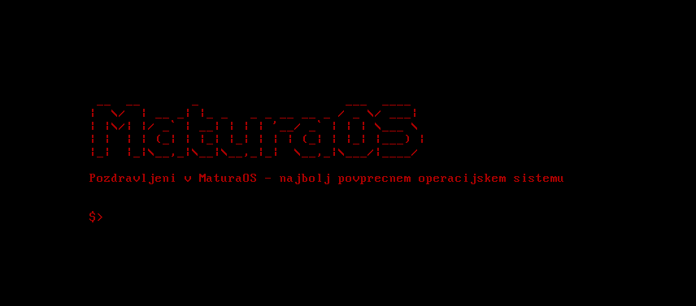

# MATURA-OS

Operacijski sistem, ki ga izdelujem za mojo maturitetno nalogo.

Cilji:
- [x] bootloader
- [x] preprosto jedro
- [ ] rezerviranje spomina
- [ ] uporabniški vnos
- [ ] preprosta školjka
- [ ] zagon izven emulatorja